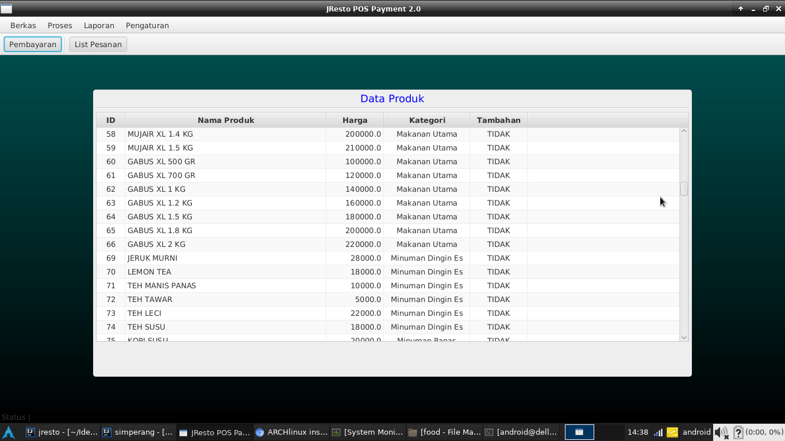

# Aplikasi POS Resto berbasis Java

## Deskripsi
Aplikasi ini dikembangkan dari aplikasi sebelumnya yang berbasis Web dan telah digunakan pada Kristo Resto.
Untuk memenuhi kebutuhan pelaporan pajak bulanan yang sesuai dengan format permintaan pemda setempat.

Pengembangan ini ditujukan untuk memasarkan secara lebih luas lagi aplikasi ini agar dapat digunakan di berbagai
restoran di wilayah Jayapura dan Papua pada umumnya.

### Modul Produk
> Menampilkan infomasi produk serta fungsi kontrol terhadap data produk.
